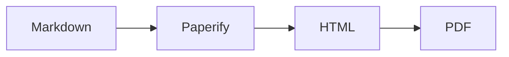

# Paperify

<p align="center">
  
</p>

[English](./README.md) | [日本語](./README.ja.md)

**CSS-first academic publishing: Markdown in, one portable HTML file out — readable on screen, printable as a two-column paper.**

Paperify is a lightweight Markdown-to-HTML converter for academic writing. It is deliberately _not_ a LaTeX clone. The converter stays small and emits minimal, semantic HTML; a carefully authored stylesheet (`paperify.css`) carries the layout and typography for both media:

- **Screen** — a single, centered reading column that is comfortable on desktop and mobile.
- **Print / PDF** — a two-column A4 academic paper, produced by the browser's own print engine. The title, authors, abstract, and keywords stay single-column; the article body flows into two columns with careful break control.

The same compiled HTML file serves both. There is no runtime JavaScript and no server. Direct `.pdf` output uses Puppeteer/Chromium at build time.

## Installation

Paperify requires Node.js 24 LTS or newer. The repo includes an `.nvmrc` pinned to the current latest LTS, Node.js 24.18.0.

```bash
npm install          # install dependencies
npm run build        # compile TypeScript to dist/
npm test             # run the test suite
npm run example      # compile examples/sample.md into dist/sample.html
```

To use the CLI from anywhere:

```bash
npm install -g .     # or: npm link
paperify input.md -o output.html
paperify input.md -o output.pdf
```

## CLI usage

```
paperify <input.md> [options]

--output, -o <file>   Compile to this path; .pdf also writes sibling .html
                      (default: <input>.html)
--css <file>          Custom CSS file path (default: bundled paperify.css)
--bib, --bibliography <file>
                      BibTeX bibliography file
                      (default: frontmatter bibliography,
                      terminal bibtex block, or <input>.bib)
--csl <id>            Zotero Style Repository CSL style ID
                      (default: computing-surveys)
--embed-css           Compatibility option; compiled HTML always embeds CSS
--unsafe-html         Allow sanitized raw HTML inside Markdown
--title <title>       Override title from frontmatter
--lang <lang>         Override the HTML language attribute
                      (default: frontmatter lang, then en)
--browser-executable <file>
                      Chrome/Chromium executable for Mermaid and PDF output
--watch               Rebuild on file changes
--copy-assets         Compatibility option; images/posters compile inline
--help                Show help
```

Paperify compiles Markdown to a self-contained HTML file. The compiled HTML embeds Paperify CSS, local images, Mermaid SVGs, video posters/fallbacks, KaTeX CSS, and KaTeX fonts as data URIs, so the HTML can be opened on its own. Video files themselves are not embedded; use `--copy-assets` if you want local video sources copied next to the output for playback.

When the output path ends in `.pdf`, Paperify first writes the compiled HTML beside the PDF, then opens that HTML with Puppeteer's Chromium engine and prints it to PDF. For example, `paperify paper.md -o dist/paper.pdf` writes both `dist/paper.html` and `dist/paper.pdf`.

## Example documents

The repository includes English and Japanese sample papers that exercise the same features: frontmatter, math, citations, figures, Mermaid diagrams, tables, code, footnotes, and video.

- `examples/sample.md` is the English sample used by `npm run example`.
- `examples/sample.ja.md` is the Japanese sample. Its frontmatter sets `lang: ja`, so the generated HTML uses `<html lang="ja">` and the bundled CSS switches to Japanese font variables with `:root:lang(ja)`.
- `examples/sample.bib` provides the shared BibTeX entries used by both samples.

Build the default English sample:

```bash
npm run example
```

Build the Japanese sample:

```bash
npm run build
node dist/cli.js examples/sample.ja.md --bib examples/sample.bib -o dist/sample.ja.html
```

Build the Japanese sample as PDF:

```bash
npm run build
node dist/cli.js examples/sample.ja.md --bib examples/sample.bib -o dist/sample.ja.pdf
```

## Markdown conventions

Paperify uses the unified ecosystem: `remark-parse` + `remark-gfm`, so standard Markdown plus GitHub-flavored extensions (tables, footnotes, strikethrough, autolinks) work as expected. Headings receive stable, slugified IDs (`## Related Work` → `id="related-work"`), so internal links survive rebuilds.

### YAML frontmatter

```yaml
---
title: "A Lightweight Markdown-to-HTML Paper Converter"
subtitle: "CSS-first academic publishing for web and print"
authors:
  - name: "Alice Example"
    affiliation: "Example University"
    email: "alice@example.edu"
  - name: "Bob Example"
    affiliation: "Example Lab"
date: "2026-07-04"
abstract: |
  One or more paragraphs of abstract text.
keywords:
  - Markdown
  - academic publishing
lang: en
footerTemplate: |
  <div style="font-size:8px;width:100%;text-align:center">
    <span class="pageNumber"></span>/<span class="totalPages"></span>
  </div>
---
```

All fields are optional. Authors may also be plain strings, and keywords may be a comma-separated string. Regular document metadata is normalized and HTML-escaped before rendering. `headerTemplate` and `footerTemplate` are used only for direct PDF output and are passed through as Puppeteer header/footer HTML templates.

`lang` sets the generated `<html lang="...">` attribute. The bundled stylesheet uses that attribute for language-aware typography; for Japanese papers, set `lang: ja` (or `language: ja-JP`) to switch the body and heading font variables automatically.

### Math

- Inline math: `$E = mc^2$`
- Display math: `$$ ... $$`

Math is rendered **statically at build time** with KaTeX — the output HTML needs no JavaScript to display equations. Compiled HTML embeds the KaTeX stylesheet and fonts from the installed `katex` package.

In print, display equations are kept inside their column, sized with restraint, and prevented from breaking across columns where the engine supports it. On screen, very long equations scroll horizontally instead of overflowing.

### Citations and references

BibTeX-backed citations use Pandoc-style citation keys:

```markdown
Paperify builds on structured Markdown processing [@unified2015unified].
Multiple sources can appear in one cluster [@foo; @bar].
```

Paperify resolves bibliography data in this order:

1. `--bib` / `--bibliography` when passed explicitly. This path is resolved from the current working directory.
2. `bibliography` in frontmatter. This path is resolved relative to the Markdown file.
3. A terminal fenced code block tagged `bibtex`. This block is hidden from the rendered HTML and used as the BibTeX source. Empty or whitespace-only terminal `bibtex` blocks are hidden but ignored as a source.
4. A BibTeX file beside the input Markdown with the same basename. For `paper.md`, Paperify uses `paper.bib` when that file exists.

You can pass a bibliography explicitly:

```bash
paperify paper.md --bib references.bib -o paper.html
```

Or keep the bibliography path in frontmatter:

```yaml
---
bibliography: references/paper.bib
---
```

For compact, portable drafts, place BibTeX at the end of the Markdown file:

````markdown
Paperify builds on structured Markdown processing [@unified2015unified].

```bibtex
@misc{unified2015unified,
  author = {{The unified collective}},
  title = {unified: Content as Structured Data},
  year = {2015},
  url = {https://unifiedjs.com}
}
```
````

If citations such as `[@key]` are present but no bibliography source can be resolved, the CLI exits with a clear error.

Citation formatting is produced at build time with Citation.js and citeproc-js. The CSL style is downloaded by ID from the Zotero Style Repository. The default style is `computing-surveys`; choose another Zotero style ID with `--csl`:

```bash
paperify paper.md --csl association-for-computing-machinery -o paper.html
```

The generated citations and references are static HTML, so the compiled document still needs no runtime JavaScript.
Citation markers link to their corresponding bibliography entries in the generated references list.

### Images and figures

A paragraph containing only an image becomes a semantic figure, with the alt text doubling as the caption:

```markdown

```

```html
<figure class="image-figure">
  
  <figcaption>Caption text</figcaption>
</figure>
```

An image without alt text still becomes a figure, but no empty caption is emitted. Images inside regular text paragraphs are left untouched.

For explicit control — including **wide figures** that span both print columns — use the figure directive:

```markdown
::figure{src="images/system.png" alt="System diagram" caption="System overview" wide=true}
```

### Mermaid diagrams

Fenced code blocks tagged `mermaid` are rendered to SVG at build time:

````markdown

````

The SVG is embedded as an image data URI inside a semantic figure. The final HTML contains neither Mermaid source nor runtime JavaScript and does not contact a CDN. Mermaid's `accDescr` becomes the image `alt` text, while `accTitle` becomes its `title`; without either, Paperify uses `Mermaid diagram` as the accessible fallback.

Mermaid rendering uses Chromium only at build time. Invalid diagrams fail CLI and PDF builds with the Mermaid parser error. The VS Code live preview instead keeps the source code block and reports a warning while the diagram is being edited.

### Video

```markdown
::video{src="media/demo.mp4" poster="media/demo-poster.png" caption="Demo video" controls=true}
```

Supported attributes: `src` (required), `poster`, `caption`, `controls` (default: on), `loop`, `muted`, `autoplay`, `wide`. The MIME type is inferred from the file extension (`.mp4`, `.webm`, `.ogg`/`.ogv`, `.mov`).

- **On screen** the video is playable with native controls.
- **In print** the `<video>` element (and its controls) is hidden. The poster image is printed instead when one exists; otherwise a clean placeholder box shows the video filename. Either way a readable "Video available at: …" source line is printed so the video remains reachable from paper.

### Tables, code, footnotes, blockquotes

- **Tables** use GFM syntax and booktabs-style thin rules. On screen, wide tables scroll horizontally; in print they are kept inside a column and protected from breaking where possible.
- **Code blocks** are fenced and highlighted at build time from their language tag, such as a `ts` fence. Unlabeled blocks remain plain text. In print, code wraps rather than clipping.
- **Footnotes** use GFM syntax (`[^1]`) and render compactly at the end of the document. True page-bottom footnotes are out of scope for v1.
- **Blockquotes** render as restrained academic notes with a thin left rule.

### Raw HTML

Raw HTML is **disabled by default** — unknown HTML in the source is dropped. With `--unsafe-html`, raw HTML is allowed but sanitized against an allowlist of safe academic elements (text semantics, headings, lists, tables, figures, images, `video`/`source`, KaTeX-compatible code classes). Scripts, event handlers, and `javascript:` URLs are always stripped.

## Screen vs. print behavior

| Aspect         | Screen                         | Print                                     |
| -------------- | ------------------------------ | ----------------------------------------- |
| Layout         | single centered column (~78ch) | two-column A4, front matter single-column |
| Body size      | 16px, line-height 1.7          | 9.5pt, line-height 1.45                   |
| Wide elements  | normal width                   | `column-span: all`                        |
| Mermaid        | static SVG                     | static SVG kept inside its column         |
| Video          | playable                       | poster / placeholder + source URL         |
| Long equations | horizontal scroll              | constrained to column                     |
| Links          | accent-colored underline       | plain text (optional URL display)         |

To print external URLs after link text, add `class="print-show-urls"` to `<body>` in a post-processing step or custom template — it is off by default to keep output quiet.

## Exporting to PDF

The recommended path is direct PDF output:

```bash
paperify paper.md -o paper.pdf
```

Paperify uses Puppeteer to open the compiled HTML file and print with Chromium's `print` media type, `preferCSSPageSize`, and background graphics enabled. The stylesheet's `@page` rule controls the A4 page size and margins.

PDF headers and footers can be controlled from YAML frontmatter:

```yaml
---
title: "Paper Title"
headerTemplate: |
  <div style="font-size:8px;width:100%;padding:0 12mm">
    <span class="title"></span>
  </div>
footerTemplate: |
  <div style="font-size:8px;width:100%;text-align:center">
    <span class="pageNumber"></span>/<span class="totalPages"></span>
  </div>
---
```

Puppeteer fills special spans by class name: `date`, `title`, `url`, `pageNumber`, and `totalPages`. Header/footer templates are rendered in Puppeteer's print margin area, so put any needed styling inline or inside a `<style>` tag in the template.

If Puppeteer cannot find or launch its managed browser, install it with `npx puppeteer browsers install chrome`, or point Paperify at an existing Chrome/Chromium binary:

```bash
paperify paper.md -o paper.pdf --browser-executable "/path/to/chrome"
```

You can still open an HTML output in a browser and choose **Print → Save as PDF**, but browser print engines vary. Chromium-based browsers remain the most predictable manual export path.

## Customizing paperify.css

The stylesheet is the deliverable that does the visual work — the HTML is intentionally plain. Everything themeable is exposed as a CSS custom property:

```css
:root {
  --font-body: Georgia, "Times New Roman", serif;
  --paper-width: 72ch;
  --accent-color: #8b0000;
}
```

Options for theming:

- **Pass your own stylesheet** with `--css mytheme.css` (start from a copy of `styles/paperify.css`; custom CSS replaces the bundled stylesheet).
- **Override variables** by editing a copied stylesheet or adding overrides to a custom stylesheet.
- **Use language-aware defaults** by setting `lang: ja` in frontmatter or passing `--lang ja`; `paperify.css` applies Japanese body and heading fonts with `:root:lang(ja)`.
- Print-specific knobs (`--print-body-size`, `--print-line-height`, `--print-column-gap`) live in the same `:root` block.

The file is organized into numbered, commented sections (tokens → base → reading column → front matter → content → print) so it is safe to edit surgically.

## Limitations

- **Not a full LaTeX replacement.** No numbered equations/theorems, cross-reference resolution, or automatic figure numbering.
- **Citation support is intentionally small.** It supports BibTeX keys such as `[@key]` and CSL bibliographies, but not citation locators, citation prefixes/suffixes, or cross-reference resolution.
- **Browser print engines vary.** Column balancing, `break-inside`, and `column-span` support differ between Chromium, Firefox, and Safari. Direct `.pdf` output uses Puppeteer/Chromium for a more stable export path.
- **Advanced float placement and true page-bottom footnotes are out of scope.** Figures print where they occur, and footnotes collect at the end of the document.

## Project layout

```
src/
  cli.ts                     CLI: args, watch, compile/PDF orchestration
  compile.ts                 self-contained compiled HTML generation
  convert.ts                 unified pipeline (remark → rehype)
  mermaid.ts                 injected Chromium renderer for static SVG
  pdf.ts                     Puppeteer PDF rendering
  template.ts                standalone HTML document assembly
  frontmatter.ts             YAML metadata parsing & normalization
  assets.ts                  local asset collection & copying
  transforms/
    figures.ts               image-only paragraph → <figure>
    figureDirective.ts       ::figure{...}
    mermaid.ts               mermaid fence → static SVG figure
    videoDirective.ts        ::video{...} + print fallback markup
    sanitizeSchema.ts        allowlist for --unsafe-html
styles/
  paperify.css               the first-class stylesheet (screen + print)
examples/
  sample.md                  demonstrates every feature
  sample.ja.md               Japanese version with lang: ja
  sample.bib                 shared bibliography for the samples
test/
  convert.test.ts            Vitest suite
  mermaid.test.ts            renderer lifecycle and caching
```

## License

GPL-3.0-only
