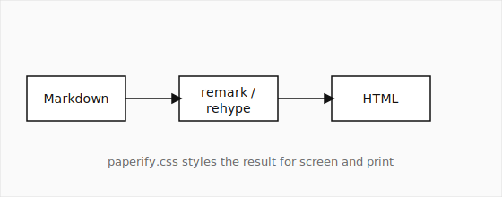

## Introduction

Academic writing tools tend to cluster at two extremes: heavyweight LaTeX
toolchains with excellent print output, and web-first Markdown renderers
with no print story at all. Paperify sits deliberately between them[^1].
The authoring format is plain Markdown, the output is a single portable
HTML file, and the _same_ document reads comfortably on a phone and
prints as a two-column paper.

The design philosophy is simple: keep the HTML semantic and stable, and
let the stylesheet do the visual work. When the converter stays out of
layout decisions, themes remain possible and documents remain durable.

## Method

Given a sequence of tokens $x_1, x_2, \ldots, x_n$, we model the joint
probability autoregressively:

$$
p(x_1, \ldots, x_n) = \prod_{i=1}^{n} p(x_i \mid x_1, \ldots, x_{i-1})
$$

The per-token loss is the negative log-likelihood
$\mathcal{L} = -\frac{1}{n}\sum_i \log p(x_i \mid x_{<i})$, rendered
here inline to show that math sits naturally within running text.

### Architecture overview

A regular Markdown image whose paragraph contains nothing else becomes a
semantic figure, with the alt text doubling as the caption:



Wide figures use a directive and span both columns in print:

::figure{src="media/system.svg" alt="System diagram" caption="Figure 2: System overview. In print this figure spans the full page width." wide=true}

### Demonstration video

Videos are embedded with a directive. On screen the video is playable;
in print the poster frame is shown with a readable source link:

::video{src="media/demo.mp4" poster="media/demo-poster.svg" caption="A short demonstration of live rebuilds in watch mode." controls=true}

## Evaluation

We compare Paperify against two baselines on document build time and
output size. Values are the median of ten runs.

| System     | Build time (ms) | Output size (KB) | Print layout |
| ---------- | --------------: | ---------------: | :----------- |
| Paperify   |              84 |               46 | two-column   |
| Baseline A |             410 |              212 | single       |
| Baseline B |           2,930 |              188 | two-column   |

The conversion pipeline itself is short. The core of it looks like this:

```ts
const processor = unified()
  .use(remarkParse)
  .use(remarkGfm)
  .use(remarkMath)
  .use(remarkDirective)
  .use(paperifyTransforms)
  .use(remarkRehype)
  .use(rehypeKatex)
  .use(rehypeStringify);
```

> Design note: every feature in this paper — math, figures, tables,
> footnotes, video — degrades gracefully. If a directive is removed,
> the document is still valid Markdown everywhere else.

## Discussion

Two-column print layout in browsers is imperfect: column balancing and
break control vary by engine[^2]. Paperify accepts this trade-off in
exchange for a zero-install toolchain. Advanced float placement and true
page-bottom footnotes are explicitly out of scope for v1.

## Conclusion

Paperify shows that a Markdown pipeline plus one disciplined stylesheet
is enough for readable, printable academic documents. The converter
stays small; the CSS carries the craft.

[^1]:
    The name follows the convention of verb-ifying nouns, which we
    neither endorse nor apologize for.

[^2]:
    Chromium generally produces the most predictable multi-column
    print output at the time of writing.

## References

1. MacFarlane, J. _Pandoc: a universal document converter._ 2006–2026.
2. The unified collective. _unified: content as structured data._ 2015–2026.
3. Knuth, D. E. _The TeXbook._ Addison-Wesley, 1984.
